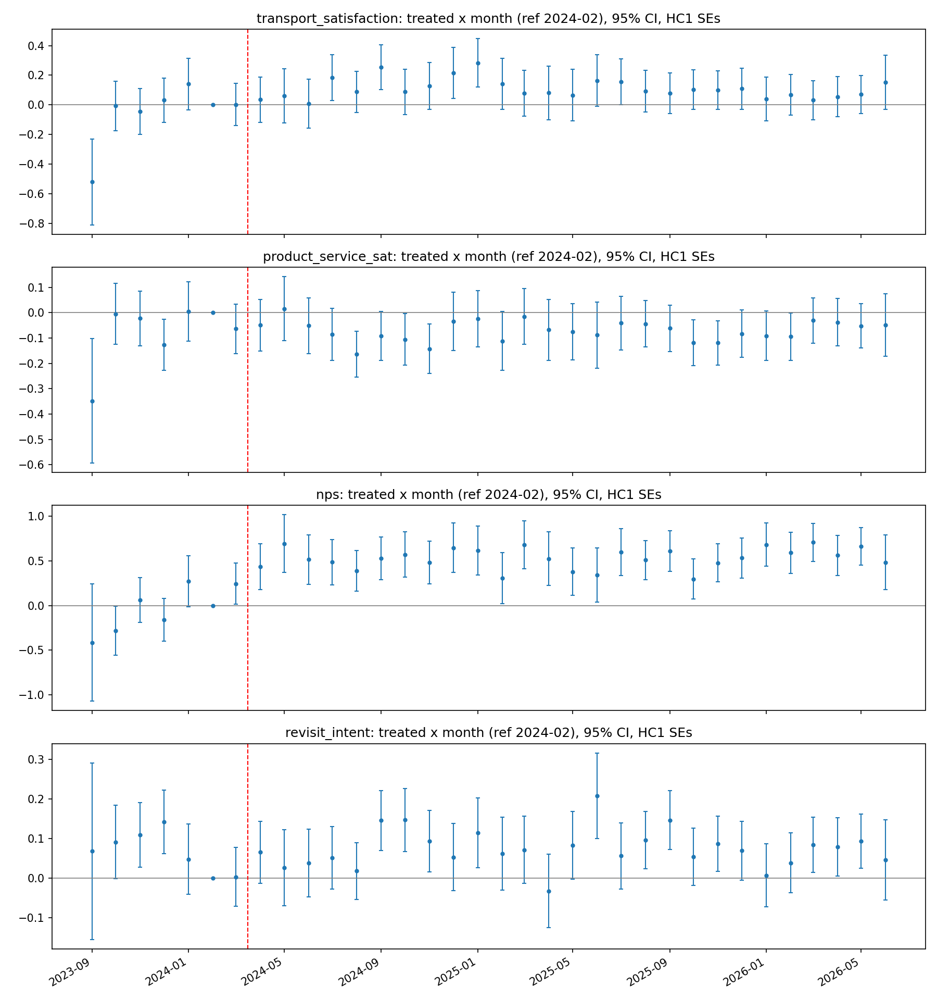

# Shinkansen DiD — thesis specification

Fukui (treated) vs Ishikawa (control); treatment 2024-03-16; DiD specs use prefecture-x-month clustered SEs; the event study uses HC1 (clustering degenerates with two clusters per month); reference month 2024-02.

## DiD estimates across specifications (treated x post)
```
                      spec                outcome  estimate  se_cluster  p_value  ci_low  ci_high      n  n_clusters
                  baseline transport_satisfaction    0.0547      0.0243   0.0243  0.0071   0.1022  51347          73
                  baseline    product_service_sat   -0.0371      0.0369   0.3143 -0.1095   0.0352 103807          73
                  baseline                    nps    0.5508      0.0507   0.0000  0.4515   0.6501 103806          73
                  baseline         revisit_intent    0.0382      0.0241   0.1130 -0.0091   0.0855  77106          73
      composition_controls transport_satisfaction    0.0617      0.0246   0.0123  0.0134   0.1099  51347          73
      composition_controls    product_service_sat   -0.0337      0.0350   0.3362 -0.1024   0.0350 103807          73
      composition_controls                    nps    0.5562      0.0468   0.0000  0.4646   0.6479 103806          73
      composition_controls         revisit_intent    0.0390      0.0235   0.0973 -0.0071   0.0850  77106          73
         drop_jan_mar_2024 transport_satisfaction    0.0773      0.0282   0.0061  0.0221   0.1326  47667          67
         drop_jan_mar_2024    product_service_sat   -0.0131      0.0494   0.7906 -0.1100   0.0837  96543          67
         drop_jan_mar_2024                    nps    0.6193      0.0450   0.0000  0.5311   0.7075  96542          67
         drop_jan_mar_2024         revisit_intent    0.0013      0.0180   0.9436 -0.0341   0.0366  71776          67
           drop_noto_sites transport_satisfaction    0.0618      0.0244   0.0112  0.0140   0.1095  50888          73
           drop_noto_sites    product_service_sat   -0.0369      0.0351   0.2932 -0.1058   0.0319 102962          73
           drop_noto_sites                    nps    0.5705      0.0484   0.0000  0.4755   0.6654 102961          73
           drop_noto_sites         revisit_intent    0.0449      0.0227   0.0477  0.0004   0.0894  76331          73
drop_jan_mar_2024_and_noto transport_satisfaction    0.0767      0.0280   0.0062  0.0217   0.1317  47213          67
drop_jan_mar_2024_and_noto    product_service_sat   -0.0170      0.0517   0.7423 -0.1184   0.0844  95707          67
drop_jan_mar_2024_and_noto                    nps    0.6483      0.0417   0.0000  0.5665   0.7301  95706          67
drop_jan_mar_2024_and_noto         revisit_intent    0.0076      0.0174   0.6593 -0.0264   0.0417  71010          67
```

## Estimate stability (point estimates by spec)
```
spec                    baseline  composition_controls  drop_jan_mar_2024  drop_jan_mar_2024_and_noto  drop_noto_sites
outcome                                                                                                               
nps                       0.5508                0.5562             0.6193                      0.6483           0.5705
product_service_sat      -0.0371               -0.0337            -0.0131                     -0.0170          -0.0369
revisit_intent            0.0382                0.0390             0.0013                      0.0076           0.0449
transport_satisfaction    0.0547                0.0617             0.0773                      0.0767           0.0618
```

## Pre-trend check
- Pre-reference event-study coefficients significant at 0.05: 6 of 20 (parallel-trends concern — inspect the plot).

## Caveats carried from the feasibility audit
- Responses, not unique respondents (public file anonymizes member IDs);
  clustering mitigates but does not eliminate repeat-responder dependence.
- Outcome composition can shift with the visitor mix the Shinkansen itself
  attracts; the composition-controls spec adjusts for gender, age band, and
  local residency, but origin-mix shifts remain part of the treatment effect.
- Instruments differ across prefectures; only identically-worded outcomes used.

