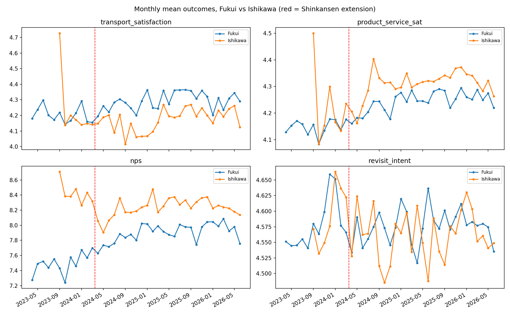

# Shinkansen DiD feasibility audit

Treatment date: 2024-03-16 (Kanazawa–Tsuruga extension opening).
Sample: Fukui (treated) vs Ishikawa (control), 103,807 respondents, 2023-04-28 – 2026-06-10.
Toyama excluded: enters merged data only in 2025 (no pre-period).

## Pre-period coverage
- Pre-treatment months with data: Fukui 12, Ishikawa 7.

## Naive DiD estimates (treated x post interaction, OLS, HC1 SEs)
```
               outcome      n  pre_fukui  post_fukui  pre_ishikawa  post_ishikawa  did_estimate  ols_interaction  se_hc1  p_value
transport_satisfaction  51347     4.2041      4.2843        4.1657         4.1912        0.0547           0.0547  0.0236   0.0205
   product_service_sat 103807     4.1450      4.2381        4.1911         4.3214       -0.0371          -0.0371  0.0164   0.0232
                   nps 103806     7.4816      7.8845        8.3982         8.2503        0.5508           0.5508  0.0393   0.0000
        revisit_intent  77106     4.5738      4.5728        4.6026         4.5633        0.0382           0.0382  0.0124   0.0021
```

## Caveats (to address before headline use)
- Survey instruments differ by prefecture (FTAS vs Ishikawa QR survey);
  identical wording verified only for the four outcomes above.
- Respondents are surveyed *visitors* — composition shifts caused by the
  Shinkansen (more first-timers, different origins) are part of the treatment
  effect, not a confound, but must be described as such. Consider
  composition-adjusted models (controls for origin prefecture, repeat visits).
- transport_satisfaction has ~50% item response; check missingness stability
  across the treatment boundary before relying on it.
- 2024 Noto earthquake (Jan 2024) hit Ishikawa during the pre-period —
  the single largest threat to parallel trends. Mitigations: drop Jan–Mar 2024,
  drop Noto-area responses, or use event-study coefficients rather than 2x2.
- p-values here are unadjusted and the model has no time or seasonality
  controls; this is a *feasibility* audit, not the thesis estimate.

